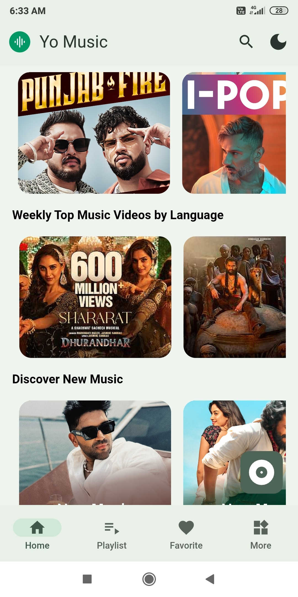
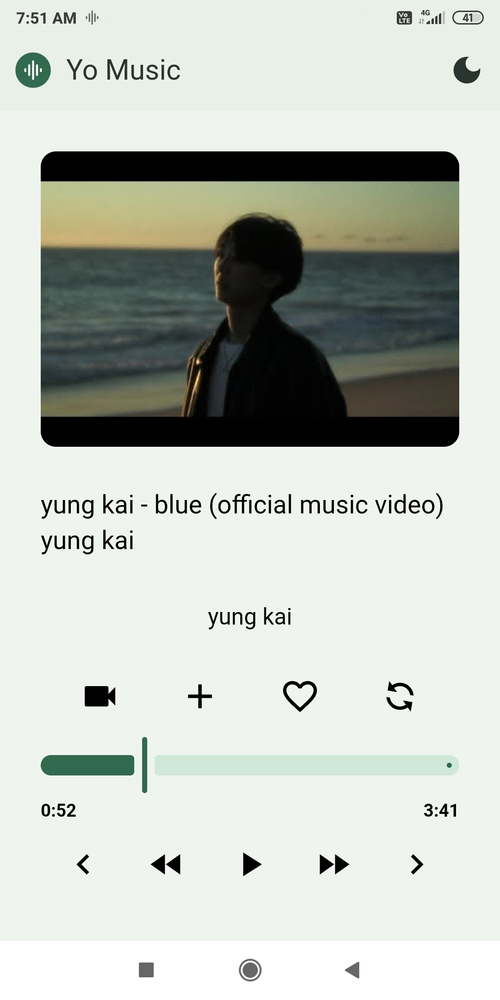
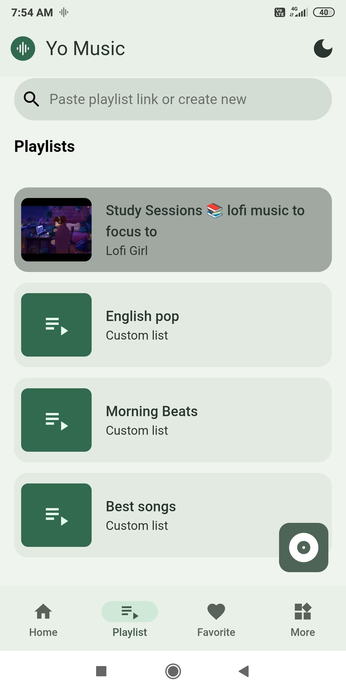
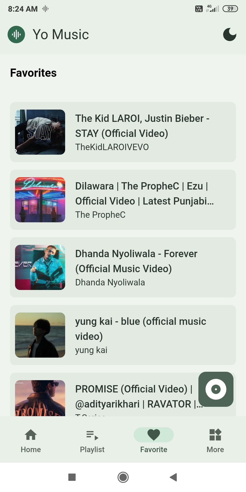

<p align="center">


</p>

<div align="center">
  <h1>Yo Music</h1>
</div>
<p align="center">Turn YouTube Videos
into Your Personal
Music Player</p>

<p align="center">


<a href="https://opensource.org/licenses/"></a>
</p>

<p align="center">


</p>

<br />

**Yo Music** is a clean and minimal youtube client built with React and Capacitor JS.
Seamlessly play YouTube videos and playlists as music tracks, ready to play in the background.

---

🌐 **Website:** https://yomusic.vercel.app

---

## Features

### 🎵 Explore Latest Music

- Browse trending and latest music library or songs.
- Paste a YouTube playlist, and we'll convert it into music that you can listen right away.

### 🎧 Background Playback

- Enjoy uninterrupted background music while working, studying, or relaxing.

### 🎨 Material 3 Design

- Sleek design based on Material 3 using KonstUI.
- Light and Dark Mode

### 🌐 Region Based Music

- Explore latest trending music, popular around you based on your region.
- Switch region in one click

### ▶ Multi Mode

- Switch between Audio or Video mode.

---

## 🔽 Download

Dowload to your device.

| Download                                                                                           |
| -------------------------------------------------------------------------------------------------- |
| [](https://github.com/beecoder-hub/yomusic/releases) |

---

## 🌷 Design

Yo Music follows a **Material Design inspired interface** using Konsta UI.

- Clean UI
- Minimal experience
- Modern Material theme
- Mobile-first design

---

## 🛠️ Built With

- ⚛️ React JS
- 🚀 Capacitor JS
- 🎨 Konsta UI
- 📱 Tailwind Css

---

## 📸 Screenshots

<table>
  <tr>
    <td align="center" width="50%">
      
      <br/>
      <b>Home Feed</b>
      <br/>
      <sub>Trending content and suggestions</sub>
    </td>
    <td align="center" width="50%">
      
      <br/>
      <b>Full Player</b>
      <br/>
      <sub>Immersive playback experience</sub>
    </td>
  </tr>
  <tr>
    <td align="center" width="50%">
      
      <br/>
      <b>Playlists</b>
      <br/>
      <sub>Custom and Youtube playlists</sub>
    </td>
    <td align="center" width="50%">
      
      <br/>
      <b>Favorites</b>
      <br/>
      <sub>Your Favorites in one place</sub>
    </td>
  </tr>
</table>

---

## 🚀 Getting Started

**Prerequisites**

Before you begin, ensure you have the following installed:

| Requirement                 | Version          | Download                                               |
| --------------------------- | ---------------- | ------------------------------------------------------ |
| **Node.js**                 | 22.x or higher   | [nodejs.org](https://nodejs.org/)                      |
| **Java JDK**                | 21 (recommended) | [Open JDK](https://jdk.java.net/archive/)              |
| **Android SDK**             | Latest           | Via Android Studio                                     |
| **Android Device/Emulator** | API 24+          | [Android Studio](https://developer.android.com/studio) |

**Clone the repository:**

```bash
git clone https://github.com/beecoder-hub/yomusic.git
cd yomusic
```

**Install dependencies:**

```bash
pnpm install
```

**Start development server:**

```bash
pnpm run start
```

---

## 🤝 Contribution

Suggestions and improvements are welcome.  
Feel free to fork the project and create a pull request.

---

## 📃 Credits

- [youtube-search-api](https://github.com/damonwonghv/youtube-search-api)
- [Gemini-3-Pro](https://gemini.google.com)
- [Claude](https://claude.ai)
- [Chat-Gpt](https://chatgpt.com)

---

## ℹ Disclaimer

- This project is not affiliated with, endorsed, or sponsored by YouTube or any of its affiliates or subsidiaries.
- All trademarks, logos, and brand names used in this project are the property of their respective owners and are used solely to describe the services provided.
- This Project Does not host, store, or redistribute any copyrighted content
- All media data and URLs are fetched from publicly accessible APIs

This project is intended for **educational and personal use only**.

## 📜 License

This project is licensed under the GNU General Public License v3.0.

More at [LICENSE](/LICENSE)

---

Made with ❤️ using Capacitor JS + React
